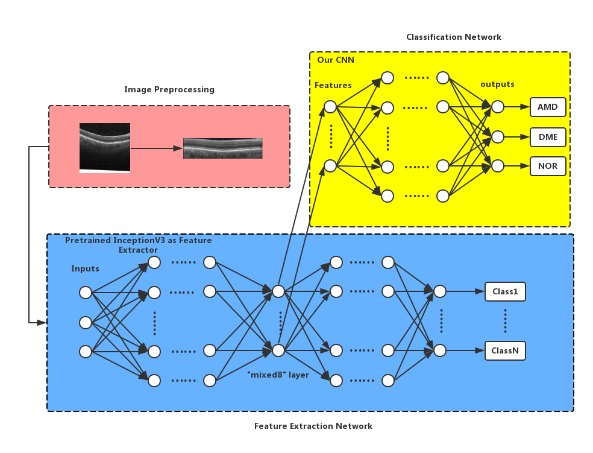

# Repository structure

controller.py - method to retina OCT images classification, including proposed method and fine-tuning method.

oct_classification.py - the implementation of proposed method.

oct_fine_tuning.py - the implementation of fine-tuning/full-training method.

divide_dataset.py - dividing data sets into training sets and test sets.

# Graphical Abstract

